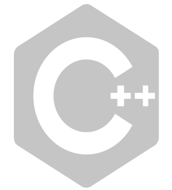
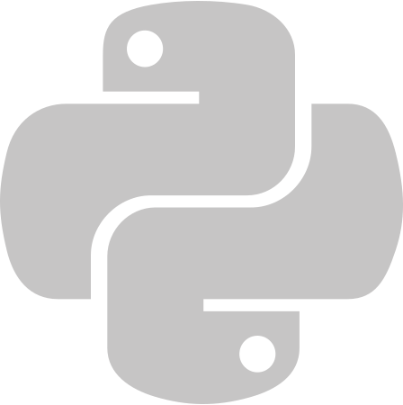
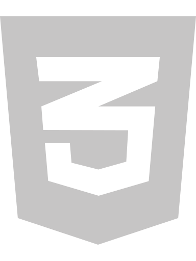
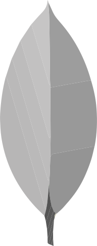
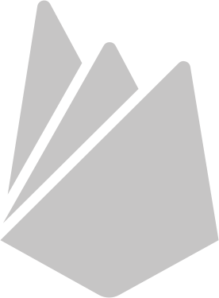
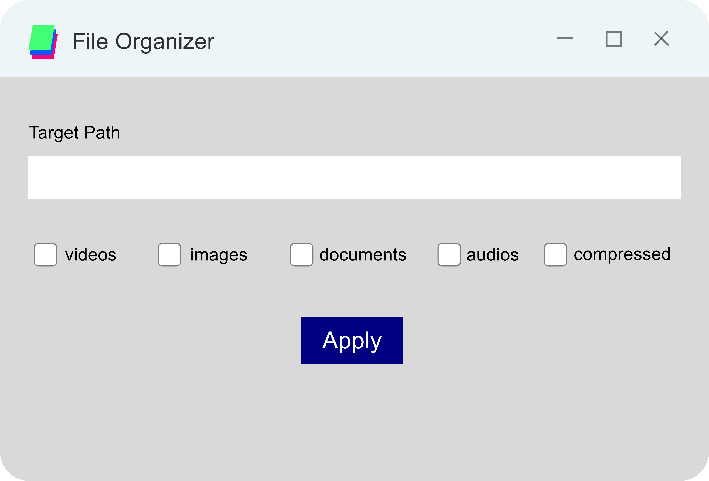
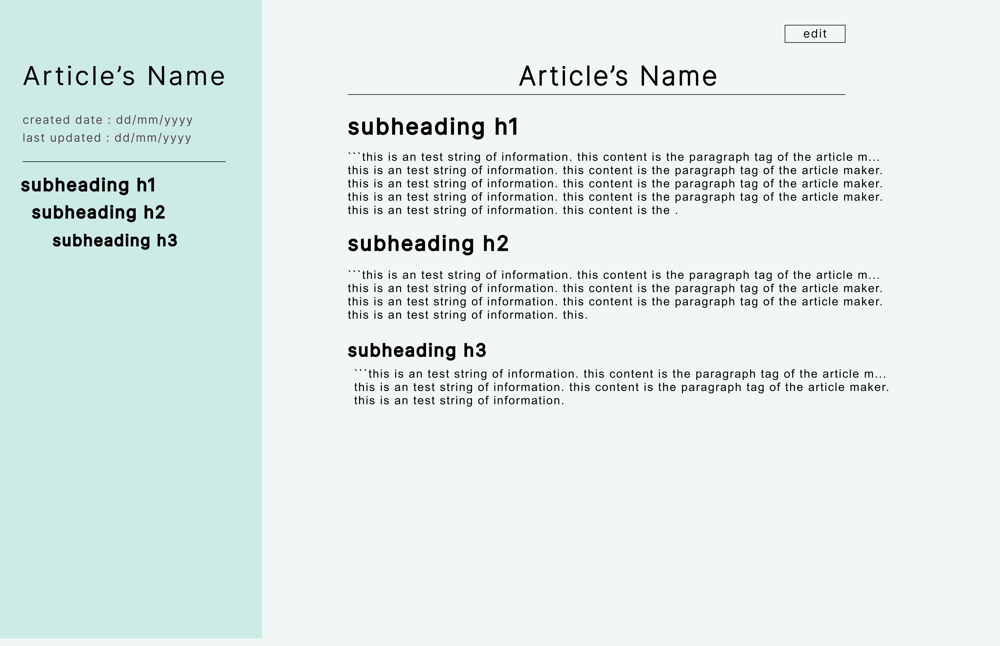

# 
Muhammad Fyrooz Razi C
 
<!-- 

 
 

 -->
<!-- ===================================== -->

Software Developer | MERN | Python 
---------------------------

I am an computer science engineering graduate, Have skills in MERN stack, Python and it's libraries, and other programming languages.

> I'm based in India

> You can contact me at [fyroozc@gmail.com](mailto:fyroozc@gmail.com)

> I'm open to collaborating on software projects
<!-- 🌍✉️🤝 -->

##
##  Skills
**programing** 
     |
|--

**Web development** | **Pyhton** | **Database**
|--|--|--
       |   |   

##
## Projects and links 

**File Organzer** <a href="https://github.com/MuhammadFyroozRazi/file_organizer" target="_blank" rel="noreferrer">code link | **Article Webapp** <a href="https://github.com/MuhammadFyroozRazi/articlewebapplication" target="_blank" rel="noreferrer">code link
|--|--
This is an python application for organizing the files inside an directory. This projects uses os,shutil modules for file operations, and tkinter for UI. Copy the Code and run in your local environment. <picture>l  </picture> | This application is an text based article creating and sharing web application created using next.js framework. Use desktop for better experience (on going project) https://articlewebapplication-cjxd3pdad-muhammadfyroozrazi.vercel.app/articles/create <picture>  </picture> 

 Exercise Tracker This is one of the final projects from Free Code Camp's certification in 'Backend Development and APIs'. I have written the entire backend of this project in 'express' and 'mongodb' as the database.- [Code Link](https://github.com/MuhammadFyroozRazi/freecode-exercise-tracker) - [App Link](https://boilerplate-project-exercisetracker-1.muhammadfyroozr.repl.co/) | File Metadata Microservice This is also one of the final projects from Free Code Camp's certification in 'Backend Development and APIs'. This is a simple microservice to show the metadata of uploaded files. I wrote the backend in Express and used the 'multer' package for accessing file data.  - [Code Link](https://github.com/MuhammadFyroozRazi/freecode-file-metadata-microservice) - [App Link](https://boilerplate-project-filemetadata.muhammadfyroozr.repl.co/)
|--|--

##
### Other certifications
Certifite from Kaggle on 'Intro to Machine Learning'  https://www.kaggle.com/learn/certification/muhammadfyroozrazic/intro-to-machine-learning  | Certifite from Free Code Camp on 'Backend Development and APIs'  https://www.freecodecamp.org/certification/Fyrooz/back-end-development-and-apis  
|--|--

##
### Socials
  |
|--

##

<!-- ### Badges -->

## My GitHub Stats

